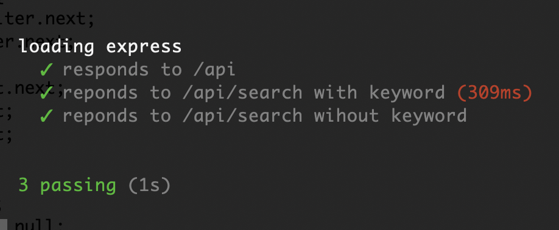
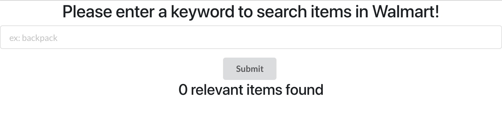
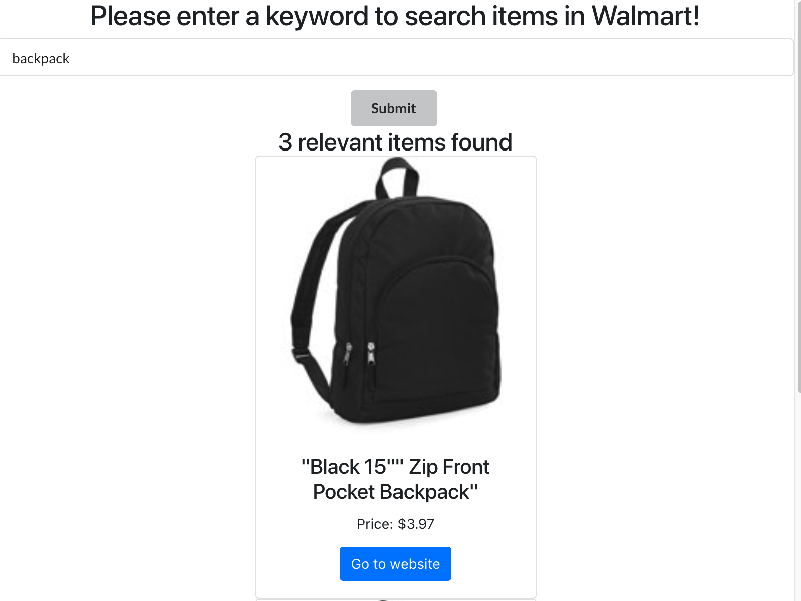

## Getting Started

1. install **node.js** and **mongoDB**

I use the online MongoDB service [mLab](https://mlab.com/)
Follow the [tutorial](https://medium.com/javascript-in-plain-english/full-stack-mongodb-react-node-js-express-js-in-one-simple-app-6cc8ed6de274) here

The only table **Items** schema is like:

```
[
  {
    "_id": {
        "$oid": "5c64d27a9c6dce3817c07a37"
    },
    "itemId": "14225185"
  },
  ...
  {
    "_id": {
        "$oid": "5c64d2f8e7179a27eb604d68"
    },
    "itemId": "14225186"
  }
]
```

2. Download the **Walmart_API_Project** from repo and install the dependencies

Under `Walmart_API_Project` and `Walmart_API_Project\client`, execute the install command

```
npm install
```

and create a **dev.js** file under **config** folder and put the words as following

```
module.exports = {
  walmartKey: <walmart_API_key>,
  mongoURI: <mongoDB_URI>
};
```

3. Run `npm run dev`, it will initiate the node server at **http://127.0.0.1:5000** and react server at at **http://127.0.0.1:3000**

4. Run `mocha -R spec spec.js` to run the unit test



## The functions of website

#### The search bar



#### The search result

Enter any keyword in search bar will display the items which contains keyword in discription. Item shows the picture, name, price and the link to url


