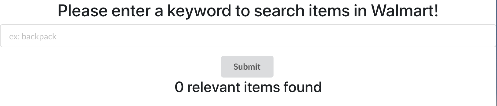

## Getting Started

install **node.js** and **mongoDB**

Download the **Walmart_API_Project** from repo and install the dependencies
```
npm install
```

create a **dev.js** file under **config** folder and put the words as following
```
module.exports = {
  walmartKey: <walmart_API_key>,
  mongoURI: <mongoDB_URI>
};
```
Run `npm run dev`, it will initiate the node server at **http://127.0.0.1:5000** and react server at at **http://127.0.0.1:3000**

## The function of website

#### The search bar



#### The search result

Enter any keyword in search bar will display the items which contains keyword in discription. Item shows the picture, name, price and the link to url


